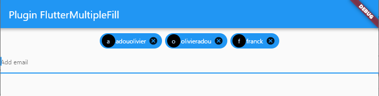

# flutter_multiple_fill

A new flutter plugin project for multiple fill.



## Installing flutter_multiple_fill
It so simple to use it !!

First, add flutter_multiple_fill as a dependency in your pubspec.yaml file.

```yaml
dependencies:
  flutter_multiple_fill: ^1.0.1
```

And after it run this command.
```
  flutter pub get
```

## Usage
Import it
```
  import 'package:flutter_multiple_fill/flutter_multiple_fill.dart';
```
Now in your Dart code, you can use like that:
```
 @override
  Widget build(BuildContext context) {
    return MaterialApp(
      home: Scaffold(
        appBar: AppBar(
          title: const Text('Plugin FlutterMultipleFill'),
        ),
        body: Center(
          child: Column(
            children: [
              const SizedBox(
                height: 10,
              ),
              FlutterMultipleFill(
                circleAvatarTextStyle: const TextStyle(fontSize: 12),
                circleAvatarColor: Colors.black,
                chipTextStyle:
                    const TextStyle(fontSize: 12, color: Colors.white),
                chipColor: Colors.blue,
                chipLabelPadding: 1,
                inputDecoration: const InputDecoration(
                  hintText: "Add email",
                  filled: false,
                  hintStyle: TextStyle(fontSize: 12),
                ),
                emailPattern: true,
                boxDecoration: const BoxDecoration(color: Colors.transparent),
                boxPadding: 0,
                keyboardType: TextInputType.emailAddress,
                // get all values as list from this function
                onfillCallback: (List value) {
                  setState(() {
                    list = value;
                    print(list);
                  });
                },
              )
            ],
          ),
        ),
      ),
    );
  }
```

# Parameters used 
Read the contents of the table below to learn more about the parameters used in this plugin.

| Parameters                | Type                       | Description                                                   |
| ------------------------- | ---------------------------|---------------------------------------------------------------|
| circleAvatarTextStyle     | TextStyle                  | Add TextStyle to circle avatar                                |
| circleAvatarColor         | Color                      | Add color to circle avatar                                    |
| chipTextStyle             | TextStyle                  | Add TextStyle to chip                                         |
| chipLabelPadding          | double                     | Add padding to chip label                                     |
| chipColor                 | color                      | Add color to chip                                             |
| inputDecoration           | InputDecoration            | Add decoration to input fill                                  |
| emailPattern              | bool                       | Set to true when you want verifiy email by pattern            |
| boxDecoration             | Decoration                 | Add decoration to a contain box                               |
| boxPadding                | double                     | Add padding to all side of box                                |
| keyboardType              | TextInputType              | Set a keyboardtype ex : TextInputType.emailAddress            |
| onfillCallback            | Function(List)             | Liten this event to get values filled as list                 |

